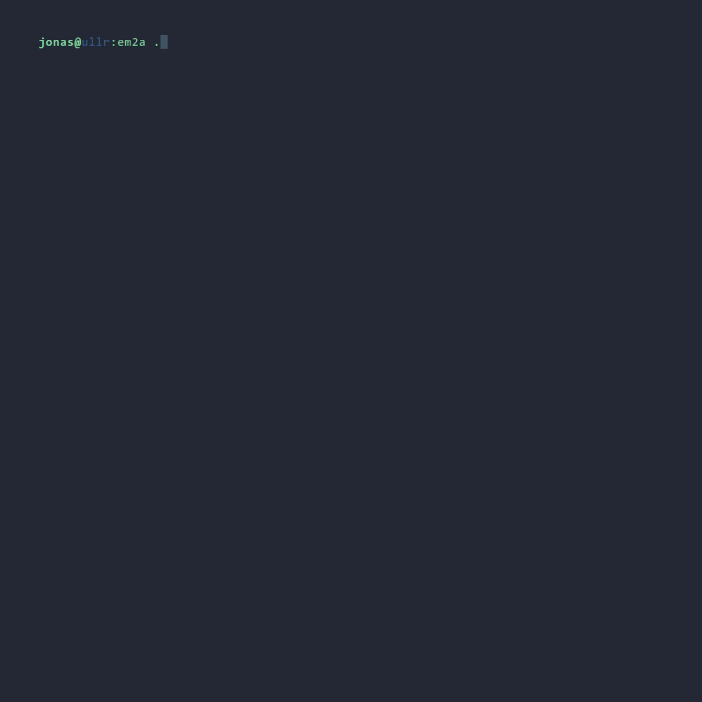

# pyem2a - Emoji to ASCII art (python)

This python script is inspired by [em2a](https://github.com/zmwangx/em2a) by [zmwangx](https://github.com/zmwangx).

## Dependencies
The following packages need to be installed
- jp2a (e.g. `sudo pacman -S jp2a`) (We need at least version [1.1.0](https://github.com/Talinx/jp2a/releases/tag/v1.1.0) due to the fact that only this version supports also png files.)

## Usage
`pyem2a` supports both raw UTF-8 emojis and [`:alias:`-styled emoji escape sequences][1] used on GitHub and friends. You can pass in one or more strings as arguments, each containing zero or more emojis in either form. Whitespace characters are automatically ignored.

[1]: https://www.webpagefx.com/tools/emoji-cheat-sheet/

Also, with the argument `--color` can the art be generated with color.

With the argument `--mirror` can the resulting ascii emoji mirrored.

## Examples

